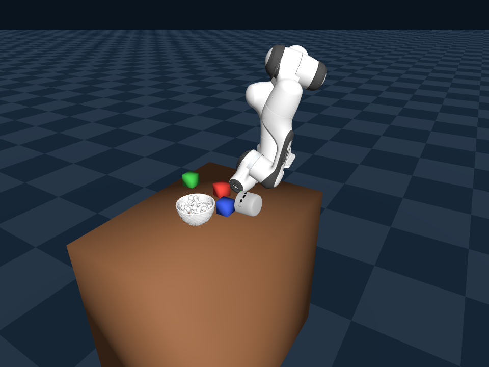

[EN](./README-en.md) | [CN](./README.md)

# RoboSmith

End-to-end pipeline from 3D assets to robot behavior data: **Gen2Sim → Scene Randomization → Closed-Loop Data Collection → VLA Post-Training → Sim Evaluation**.

## Pipeline

```
┌─────────────────────────────────────────────────────────────────────┐
│ Part 1: Sim-Ready Assets                                            │
│                                                                     │
│  Text query → AssetLibrary.search()                                 │
│                  │                                                  │
│              hit / miss → T2I (SDXL-Turbo) → TRELLIS.2-4B → URDF   │
│                  │                                                  │
│                  ▼                                                  │
│  Sim-Ready Asset (URDF + PBR GLB + collision hull + stable_poses)   │
└───────────────────────────────┬─────────────────────────────────────┘
                                │
┌───────────────────────────────▼─────────────────────────────────────┐
│ Part 2: Sim-to-Policy Pipeline                                      │
│                                                                     │
│  SceneConfig (tabletop_simple)                                      │
│       │                                                             │
│       ▼                                                             │
│  Collision-aware random placement (stable_pose + AABB/FCL)          │
│       │                                                             │
│       ▼                                                             │
│  Genesis sim (Franka + Table + Objects)                              │
│       │                                                             │
│       ├── IK scripted collection (open-loop baseline)               │
│       └── DART closed-loop collection (σ perturbation + correction) │
│               │                                                     │
│               ▼                                                     │
│  LeRobot v3.0 dataset → SmolVLA Post-Training → Closed-loop eval   │
└─────────────────────────────────────────────────────────────────────┘
```

<p align="center">
  
  <br>
  <em>tabletop_simple scene: Franka arm + collision-aware random placement (Genesis, MI300X)</em>
</p>

## Quick start

```bash
pip install -e .

# Import Objaverse high-quality assets (10 categories, 24 variants, ~50 MB on-demand)
pip install objaverse
python scripts/import_objaverse.py

robotsmith list                    # list all assets
robotsmith search "cup"            # search
robotsmith scene tabletop_simple   # resolve scene preset

# Generate a new asset (requires GPU, ≥24 GB VRAM)
robotsmith generate "red ceramic mug" --image reference.png                     # default TRELLIS.2, 1K PBR
robotsmith generate "red ceramic mug" --image reference.png --quality fast      # 512 PBR, 100K faces (RL batch)
robotsmith generate "red ceramic mug" --image reference.png --quality high      # 4K PBR, 1M faces (paper figs)
robotsmith generate "red ceramic mug" --image reference.png --backend hunyuan3d # Hunyuan3D fallback
robotsmith generate "red ceramic mug"   # no image: auto T2I → 3D

# Validate all assets
pip install pybullet
robotsmith validate
```

## 3D Generation

**Asset strategy**: 10 categories of tabletop manipulation objects (24 variants, ~60 MB), maximizing geometric topology diversity.
Primary source: [Objaverse](https://objaverse.allenai.org/) on-demand import. Auto-generates via TRELLIS.2-4B @512 on search miss. Pluggable backend architecture (`GenBackend` ABC).

**Default categories** (selected for geometric coverage, not household taxonomy):

| Category | Geometry | Variants | Source |
|----------|----------|:--------:|--------|
| Mug | cylinder + handle | 3 | Objaverse |
| Bowl | concave hemisphere | 2 | Objaverse |
| Block | cuboid | 3 | Primitive |
| Can | short cylinder | 2 | Objaverse |
| Bottle | tall cylinder + narrow neck | 2 | Objaverse |
| Fruit toy | sphere / ellipsoid | 3 | Objaverse |
| Figurine | irregular convex hull | 3 | Objaverse |
| Plate | flat disc | 2 | Objaverse |
| L-block | non-convex body | 2 | Primitive |
| Small box | flat cuboid | 2 | Primitive |

| Backend | Model | PBR | VRAM | ROCm | Status |
|---------|-------|:---:|------|------|--------|
| **`trellis2`** | [TRELLIS.2-4B](https://github.com/ZJLi2013/TRELLIS.2/tree/rocm) | Yes | ≥24 GB | Verified (MI300X) | **Default** — 1K PBR (512/4K selectable), no base artifact, no bpy dependency |
| `hunyuan3d` | [Hunyuan3D-2.1](https://github.com/Tencent-Hunyuan/Hunyuan3D-2.1) | Yes | ≥29 GB | Verified (MI300X) | Fallback |

Default pipeline (TRELLIS.2-4B):

```
ref image → TRELLIS.2-4B (4B, ~275s, ≥24GB) → O-Voxel → remesh + PBR bake → GLB
```

**Texture resolution presets** (`--quality`):

| Preset | Texture | Faces | GLB | Use case |
|--------|:-------:|:-----:|:---:|----------|
| `fast` | 512 | 100K | ~2 MB | RL batch training, fast iteration |
| `balanced` (default) | **1024** | **200K** | **~8 MB** | sim experiments, demos, grasp tests |
| `high` | 4096 | 1M | ~38 MB | paper figures, showcases |

> Collision mesh is generated via trimesh convex hull, independent of texture resolution.
> 1K PBR is visually indistinguishable in sim viewports (640×480 – 1024×768), while reducing GLB from 38 MB to ~8 MB for faster sim loading.
> Weights: [microsoft/TRELLIS.2-4B](https://huggingface.co/microsoft/TRELLIS.2-4B). ROCm fork: [ZJLi2013/TRELLIS.2@rocm](https://github.com/ZJLi2013/TRELLIS.2/tree/rocm).

### Asset directory structure

```
assets/
├── objects/                              # Built-in assets (metadata.json git tracked, large files git ignored)
│   ├── mug_01/
│   │   ├── model.urdf                    # references visual + collision mesh
│   │   ├── visual.glb                    # PBR mesh (git ignored)
│   │   ├── collision.obj                 # collision convex hull (git ignored)
│   │   ├── metadata.json                 # physics props + tags + stable_poses (git tracked)
│   │   └── provenance.json              # Objaverse UID / provenance (git tracked)
│   ├── block_red/                        # Primitive: URDF + metadata only (all git tracked)
│   ├── table_simple/
│   └── plane/
├── generated/                            # Pipeline-generated assets (all git ignored)
│   └── red_ceramic_mug_trellis2/
└── catalog.json                          # Lightweight index (git tracked)
```

## Scene presets

| Scene | Description |
|-------|-------------|
| `tabletop_simple` | Table + mug + bowl + 3 blocks |

## Visualization

### 3D scene preview (viser)

```bash
pip install -e ".[viz]"
robotsmith view tabletop_simple            # opens browser at http://localhost:8080
robotsmith view --asset mug_red            # preview single asset

# Remote GPU node
ssh -L 8080:localhost:8080 user@gpu-node
robotsmith view tabletop_simple
```

### Asset gallery (zero-dependency HTML)

```bash
python scripts/browse_assets.py            # generates gallery.html and opens it
python scripts/browse_assets.py --no-open  # generate only
```

- Built-in assets show SVG geometry preview; generated assets show T2I reference images
- Supports All / Built-in / Generated filtering
- Self-contained HTML, viewable offline

## Sim-ready maturity

```
Level   Requirement                     Status
─────   ───────────                     ──────
L0      Loads in simulator              ✅
L1      Collision works                 ⚠️  Convex hull approximation (concavities lost)
L2      Material-accurate physics       ❌  Not yet
L3      Visually realistic (PBR)        ✅  TRELLIS.2 PBR (1K default, 512/4K selectable)
```

## Dependencies

**Core (no GPU):** `trimesh >= 4.0`, `numpy >= 1.24`

**Optional:**
- `viser >= 1.0` — 3D visualization (`pip install -e ".[viz]"`)
- `pybullet >= 3.2` — physics validation
- `torch >= 2.0` — 3D generation (ROCm / CUDA)
- [TRELLIS.2](https://github.com/ZJLi2013/TRELLIS.2/tree/rocm) — **default 3D backend** (ROCm fork, 1K PBR default)
- [Hunyuan3D-2.1](https://github.com/Tencent-Hunyuan/Hunyuan3D-2.1) — fallback 3D backend
- `genesis-world >= 0.2` — Genesis simulator (Part 2)

## Sim-to-Policy pipeline

```bash
# 1. Data collection (Genesis + Franka, collision-aware random scenes)
python pipeline/collect_data.py --n-episodes 100 --scene tabletop_simple --save
python pipeline/collect_data_dart.py --n-episodes 100 --save     # DART closed-loop

# 2. SmolVLA Post-Training
python pipeline/train_smolvla.py --dataset-id local/franka-pick-100ep --n-steps 2000

# 3. Closed-loop sim evaluation
python pipeline/eval_policy.py --policy-type smolvla --checkpoint outputs/smolvla/final
```

Two data collection modes:
- **Open-loop IK scripted**: deterministic trajectories, fast batch generation of baseline data
- **DART closed-loop**: applies Gaussian perturbation (σ) to IK trajectories, then corrects back to reference, generating recovery behavior data

## Roadmap

| Stage | Goal | Key dimension | VLA model | Status |
|:-----:|------|---------------|-----------|:------:|
| **1** | Single-object + pose generalization (unseen 80%+) | DART closed-loop data + training tuning | SmolVLA (450M) | 🔄 |
| 2 | Multi-object generalization | gen2sim object variants | SmolVLA (450M) | 📋 |
| 3 | Mid-horizon multi-step tasks (stacking) | Multi-step reasoning | [StarVLA](https://github.com/starVLA/starVLA) (Qwen3-VL 4B) | 📋 |
| 4 | Long-horizon tasks | Long-sequence planning | StarVLA (Qwen3-VL 4B) | 📋 |

## More docs

- [docs/background.md](docs/background.md) — Technical background (watertight meshes, URDF, convex hull approximation)
