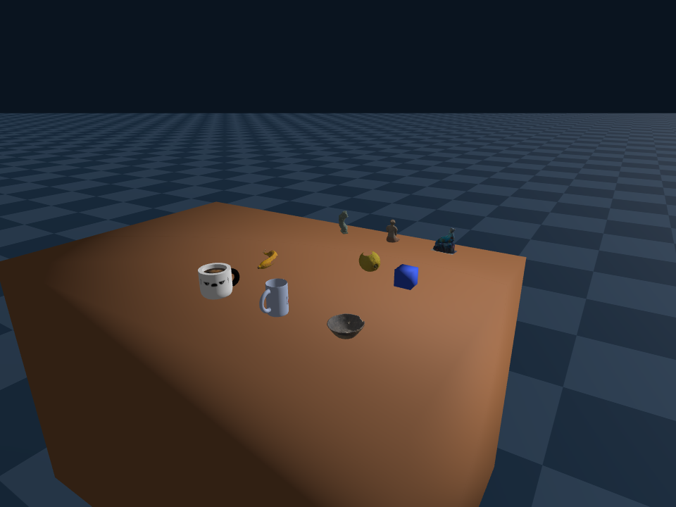

# RoboSmith

中文 | [English](README-en.md)

**Synthetic Data Generation for Physical AI / Robotics on AMD ROCm.**

RoboSmith 是一条 **manipulation 数据管线**:你用代码定义任务,它负责搭场景、规划抓取、执行避障专家轨迹,并导出可直接训练的 LeRobot 数据集 + 视频。

它是 ROCm Physical AI 工具链里的 **SDG 一环**,与同生态的另外两个仓库衔接:

```text
RocRecon   (real2sim:prompt/图像 → sim-ready URDF 资产)
   │  产出资产
   ▼
RoboSmith  (SDG:资产 + 任务 → 专家轨迹 → LeRobot 数据)   ← 本仓库
   │  调用运动后端
   ▼
rocRobo    (无碰撞 IK + 避障 trajopt,运动求解)
```

<p align="center">
  
</p>

## 能生成什么

用一段 Python 描述「桌上放什么、做哪几步、怎么算成功」,RoboSmith 就产出一条带视频的连续 episode + LeRobot 数据集 + 成功/失败诊断:

- **刚体抓放**:给定物体与目标位,自动「抓取 → 搬运 → 放置」。抓取点由 learned grasp 模型生成并按可行性筛选,无需手写轨迹。
- **多步长程任务**:多个动作串成一条 episode,如「开抽屉 → 抓物体 → 放进抽屉 → 关抽屉」——机械臂自动避开柜体、贴近时走受控直线接触,每步按物体实时位置重新对准。示例:[`scenarios/pick_place_into_drawer.py`](scenarios/pick_place_into_drawer.py)。
- **声明式任务定义**:用一套小型 API 写任务(成功条件支持 且/或/非 组合),不必触碰底层 IK 或轨迹生成。

## 快速开始

```bash
pip install -e .

# 多步长程任务(开/关抽屉 e2e,canonical 启动器,自带 rocRobo 避障 sidecar)
bash scripts/setup/run_scenario.sh

# 内层入口:单个 scenario
python scripts/datagen/run_generated_scenario.py \
  --scenario scenarios/pick_place_into_drawer.py --smoke

# 静态布局出图(不跑 rollout)
python scripts/datagen/snapshot_scenario.py \
  --scenario scenarios/pick_place_into_drawer.py
```

新 scenario 的写法见 [`scenarios/README.md`](scenarios/README.md)。

### 运行前置

数据生产依赖三样**仓库外**的运行时(各自单独安装/授权,不随本仓库分发):

- **ROCm 运行镜像**:Genesis 物理仿真,按 GPU 架构选镜像,见 [`docker/README.md`](docker/README.md)(MI300/gfx942 用 `docker/Dockerfile.gfx942`)。
- **rocRobo 运动后端**:无碰撞 IK + 避障 trajopt,来自 [rocRobo](https://github.com/ZJLi2013/rocRobo),以 sidecar 形式运行(license-friendly,PyRoki/JAX)。
- **learned grasp 运行时**:抓取候选模型 + 权重(**第三方许可,需自备,不包含在本仓库**)。

## 代码结构

```text
robotsmith/
├── assets/            # Asset / AssetMetadata / AssetLibrary(exact-id),内置资产 + catalog
├── cap/               # 声明式任务定义层(scene/task/success/skill intent)
├── scenes/            # SceneConfig / ObjectPlacement、upright pose、Genesis loader
├── tasks/             # TaskSpec、谓词、任务预设
├── scenario_runtime/  # scenario 加载 / 物化 / 段级闭环 runner
├── grasp/             # grasp planner(learned)+ 可行性 rerank
├── motion/            # 运动规划 + rocRobo 避障后端接入
├── execution/         # executor:把技能展开成关节轨迹
├── skills/            # 技能原语(pick/place/open/close)+ registry
├── sim/               # Genesis SimEnv + Franka + LeRobot recorder
└── rollout/           # rollout 编排、episode 布局、视频导出
```

## 致谢

- [LeRobot](https://github.com/huggingface/lerobot) — 数据集格式与 VLA 训练基础设施
- [Genesis](https://github.com/Genesis-Embodied-AI/Genesis) — GPU 加速物理仿真
- [rocRobo](https://github.com/ZJLi2013/rocRobo) — 运动求解(无碰撞 IK + 避障 trajopt)
- [RocRecon](https://github.com/ZJLi2013/RocRecon) — real2sim 资产生成(prompt/图像 → sim-ready URDF)
- [Objaverse](https://objaverse.allenai.org/) — 3D 物体数据集

## License

Apache-2.0,见 [LICENSE](LICENSE)。
