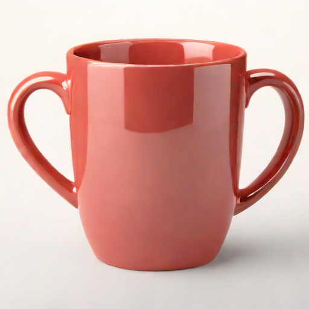
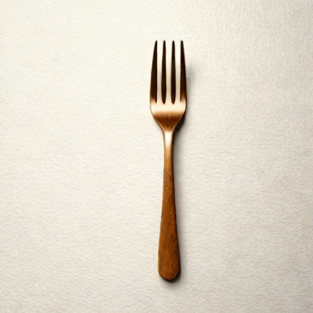
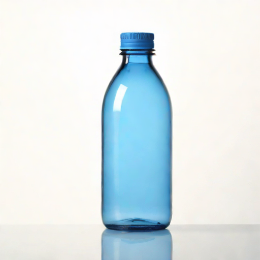
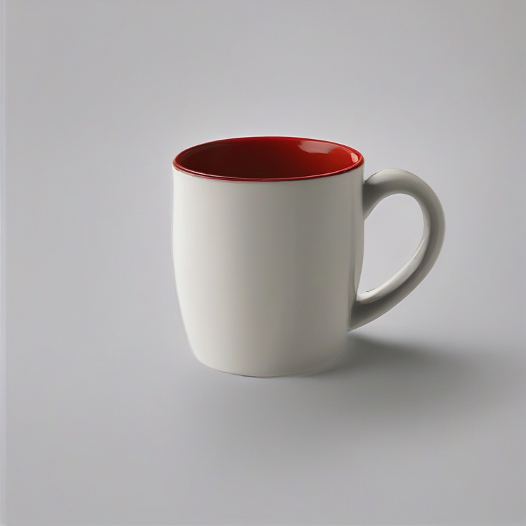
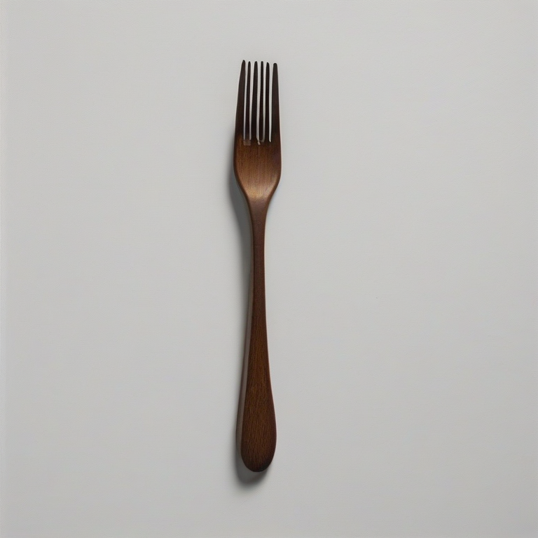
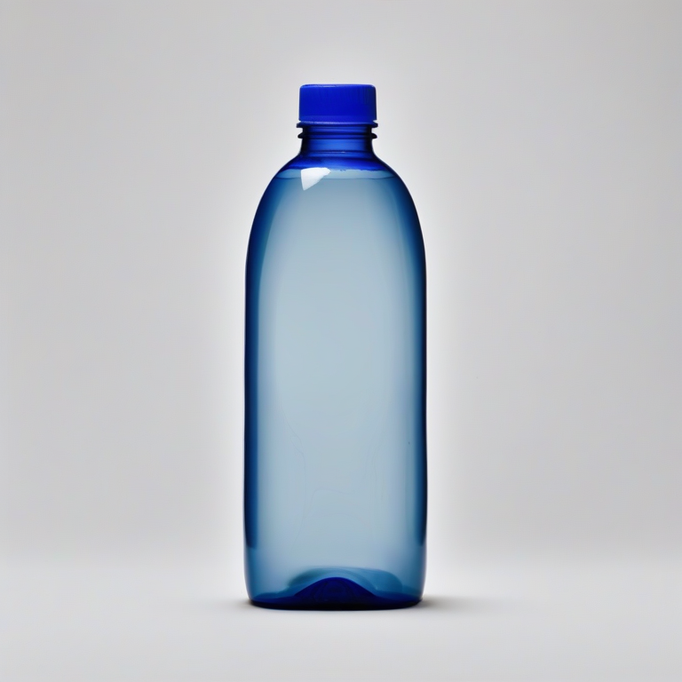
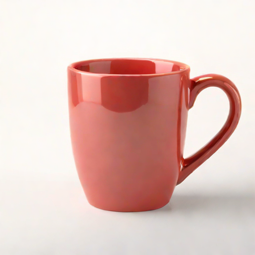
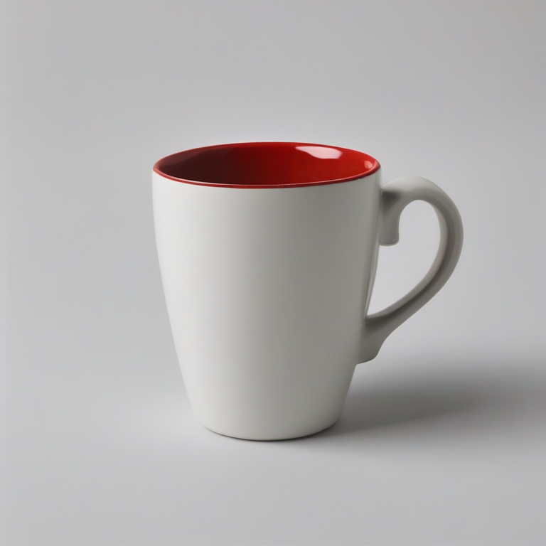

# RoboSmith Demo — 从零复现完整 Pipeline

从环境搭建到 3D 资产生成的端到端复现，覆盖：

```
文本查询 / 参考图片
       │
       ├─ 有参考图 ──────────────────────────────────────────────┐
       │                                                         │
       └─ 仅文本 → SDXL-Turbo T2I (512×512, 3s) → 参考图片 ✅    │
                                │                                │
                                ▼                                ▼
                      Hunyuan3D-2.1 shape gen (image→3D, 207K verts, ~59s)
                                │
                                ▼
                      trimesh → mesh_to_urdf → URDF + 碰撞网格 → 入库 → PyBullet 验证
```

**输入说明**：
- **图片模式**（`--image`）：直接提供单张物体参考图片，推荐干净背景、512×512+
- **文本模式**（`--prompt` + `--use-t2i`）：自动通过 SDXL-Turbo 生成 3D 重建友好参考图片（512×512, ~3s），再送入 Hunyuan3D-2.1
- Hunyuan3D-2.1 是 **single-image-to-3D** 模型，不支持多视角输入
- **T2I 桥接已验证**：SDXL-Turbo (stabilityai/sdxl-turbo) 在 MI300X + ROCm 6.4 上 0.3s/img，8GB VRAM
  - FLUX.1-dev 质量更高但需要 HuggingFace 认证（gated repo），可作为升级路径
  - 512×512 分辨率最优（Hunyuan3D 内部 DINOv2 resize 到 518×518）
- 详见 [docs/design.md §1.4](../docs/design.md#14-text-to-image-桥接组件) 和 [experiments.md RS-6/RS-9](../experiments.md)

## 前提条件

| 项目 | 要求 |
|------|------|
| GPU | AMD MI300X / MI308X (ROCm 6.4+) 或 NVIDIA (CUDA 12+) |
| VRAM | ≥10 GB（仅 shape gen）；≥29 GB（shape + PBR texture） |
| 磁盘 | ≥40 GB（模型权重 ~30GB + 依赖） |
| Docker | `rocm/pytorch:rocm6.4.3_ubuntu24.04_py3.12_pytorch_release_2.6.0` |
| T2I (文本模式) | `pip install diffusers transformers accelerate` (~8 GB 额外 VRAM) |

## 快速开始

### 方式 1：一键脚本（远端 GPU 节点，推荐）

```bash
# SSH 到 GPU 节点
ssh -A user@gpu-node

# 启动 ROCm Docker 容器
DATA_DIR="/data"  # 或 "/tmp"，取决于节点
docker run --rm -it \
  --name robotsmith_demo \
  --device=/dev/kfd --device=/dev/dri \
  --ipc=host --security-opt seccomp=unconfined \
  -v ${DATA_DIR}:${DATA_DIR} \
  -e HIP_VISIBLE_DEVICES=0 \
  -e PYTORCH_ROCM_ARCH=gfx942 \
  -w ${DATA_DIR}/robotsmith \
  rocm/pytorch:rocm6.4.3_ubuntu24.04_py3.12_pytorch_release_2.6.0 \
  bash

# 容器内执行
bash demo/setup_env.sh          # 安装依赖 + clone Hunyuan3D-2.1

# 方式 A：有参考图（直接）
python demo/run_pipeline.py --image demo/sample_images/mug.png

# 方式 B：纯文本（SDXL-Turbo T2I → Hunyuan3D-2.1, 已验证 ✅）
python demo/run_pipeline.py --prompt "red ceramic mug" --use-t2i
```

### 方式 2：分步执行

```bash
# 1. Clone RoboSmith + 安装
git clone https://github.com/<your-org>/robotsmith.git
cd robotsmith
pip install -e .

# 2. Clone Hunyuan3D-2.1
git clone https://github.com/Tencent-Hunyuan/Hunyuan3D-2.1
cd Hunyuan3D-2.1

# 清洗 requirements（跳过 torch/cupy/bpy pin）
EXCLUDE_PKGS="torch|torchvision|torchaudio|cupy|bpy|flash.attn|triton"
grep -vEi "^(${EXCLUDE_PKGS})([<>=!~;[:space:]]|$)" requirements.txt > req_clean.txt
pip install -r req_clean.txt

# 编译 custom_rasterizer（ROCm 需加 --no-build-isolation）
cd hy3dpaint/custom_rasterizer
pip install -e . --no-build-isolation
cd ../..

# 编译 DifferentiableRenderer
pip install pybind11
cd hy3dpaint/DifferentiableRenderer
bash compile_mesh_painter.sh
cd ../..

cd ..  # 回到 robotsmith/

# 3. 设置 Hunyuan3D repo 路径
export HUNYUAN3D_REPO_PATH=$(pwd)/Hunyuan3D-2.1

# 4. 运行 demo
python demo/run_pipeline.py
```

## 文件说明

| 文件 | 用途 |
|------|------|
| `setup_env.sh` | 一键环境搭建（clone + install + compile） |
| `run_pipeline.py` | 端到端 Python 脚本：生成 → 转换 → 入库 → 验证 |
| `sample_images/` | 示例输入图片（用于 image-to-3D） |
| `results/rs6_t2i/` | T2I 生成效果 (SDXL-Turbo 512 + SDXL-Base 768) |
| `results/rs_e2e/` | E2E 对比：Turbo vs Base 参考图 + Hunyuan3D mesh |
| `README.md` | 本文件 |

### 已验证的两种模式

```
模式 A（图片）：用户提供参考图片 → Hunyuan3D-2.1 → mesh_to_urdf → URDF        (~60s)
模式 B（文本）：用户输入文本 → SDXL-Turbo T2I → 参考图片 → Hunyuan3D-2.1 → URDF (~63s)
```

两种模式均已在 MI308X + ROCm 6.4 上验证通过（RS-6、RS-9）。

## 实验结果展示

### RS-6: T2I 桥接 — 3D 重建友好生成效果

以下图片在 MI308X + ROCm 上自动生成，作为 Hunyuan3D-2.1 的输入参考图。
Prompt 采用约束系统模板（`isolated object, no surface, no ground, sharp edges, opaque, ...`），
详见 [docs/design.md §1.4](../docs/design.md#prompt-工程--3d-重建友好)。

**SDXL-Turbo（默认, guidance=0.0, 512px, 0.3s/img）**:

| Text Prompt | 生成结果 |
|:------------|:--------:|
| `"red ceramic mug"` |  |
| `"wooden fork"` |  |
| `"blue plastic bottle"` |  |

**SDXL-Base（备选, CFG=4.5, 768px, ~3s/img + negative prompt）**:

| Text Prompt | 生成结果 |
|:------------|:--------:|
| `"red ceramic mug"` |  |
| `"wooden fork"` |  |
| `"blue plastic bottle"` |  |

### E2E: Text → T2I → Hunyuan3D → URDF（Turbo vs Base）

**输入文本**: `"red ceramic mug"` (seed=42, 约束系统 prompt)

| | SDXL-Turbo (默认) | SDXL-Base (备选) |
|:--|:--:|:--:|
| T2I 参考图 |  |  |
| T2I 耗时 | 2.9s | 66.9s |
| Shape gen | 59.2s (525K verts) | 61.2s (379K verts) |
| **总耗时** | **64.4s** | **129.7s** |
| 颜色准确度 | 红色 (正确) | 白杯+红内壁 (偏差) |

> **结论**: SDXL-Turbo 作为默认 — 速度快 2x、颜色更准、mesh 更密。
> Base 的低 CFG (4.5) 修复了复杂背景但牺牲了颜色精度。详见 [experiments.md RS-9](../experiments.md)。

## 预期输出

### 文本模式 (`--prompt "red ceramic mug" --use-t2i`)

```
[Step 4] Generating 3D asset with hunyuan3d (text → T2I → 3D)...
  Text: 'red ceramic mug'
  T2I prompt: a single red ceramic mug, centered, isolated object, pure white b...
  T2I: 3.0s → demo/sample_images/t2i_generated.png (247 KB)
  ...
  Pipeline Results:
    Asset:    red_ceramic_mug_20260408_100000
    URDF:     assets/generated/red_ceramic_mug_20260408_100000/model.urdf
    Vertices: 207,739
    Time:     64.4s (T2I=2.9s + shape=59s + convert=2.3s)
```

### 图片模式 (`--image demo/sample_images/mug.png`)

```
[Step 4] Generating 3D asset with hunyuan3d (image mode)...
  Input image: .../demo/sample_images/mug.png
  ...
  Pipeline Results:
    Asset:    red_ceramic_mug_20260408_100000
    URDF:     assets/generated/red_ceramic_mug_20260408_100000/model.urdf
    Vertices: 344,389
    Time:     60.1s
```

## 常见问题

**Q: `ModuleNotFoundError: No module named 'hy3dshape'`**
A: 设置 `HUNYUAN3D_REPO_PATH` 环境变量指向 Hunyuan3D-2.1 clone 目录。

**Q: `custom_rasterizer` 编译失败**
A: ROCm 上需要 `--no-build-isolation` 和 `PYTORCH_ROCM_ARCH=gfx942`：
```bash
PYTORCH_ROCM_ARCH=gfx942 pip install -e . --no-build-isolation
```

**Q: 模型下载慢**
A: 模型约 30GB，首次下载需要时间。后续会缓存在 `~/.cache/huggingface/`。
可以预先下载：`huggingface-cli download tencent/Hunyuan3D-2.1`

**Q: GPU 内存不足**
A: Shape gen 需要 ~10GB VRAM。确保 `HIP_VISIBLE_DEVICES` 指向空闲 GPU。

**Q: 能否不提供图片，只用文本生成？**
A: 可以！使用 `--prompt "描述" --use-t2i` 自动通过 SDXL-Turbo 生成参考图片。
已在 MI300X + ROCm 6.4 验证通过，额外耗时仅 ~3s，VRAM +8GB。
详见 [experiments.md RS-6/RS-9](../experiments.md)。

**Q: 为什么用 SDXL-Turbo 而不是 FLUX？**
A: FLUX.1-dev/schnell 是 gated repo，需要 HuggingFace 认证。SDXL-Turbo 无需认证、Apache 2.0 开源、
4 步推理 (0.3s/img)，质量足够生成干净的参考图片。FLUX 作为升级路径保留。

**Q: T2I 输出分辨率为什么是 512×512？**
A: Hunyuan3D-2.1 内部 DINOv2 encoder 将输入 resize 到 518×518，更高分辨率不会提升 3D 质量，
反而增加 T2I 推理时间和 VRAM 消耗。512×512 是最优平衡点。

**Q: T2I Prompt 为什么设计成这样？可以自定义吗？**
A: Prompt 采用"约束系统"而非"自然描述"，每个关键词对应一条 3D 重建约束：
`isolated object` 隔离前景、`no surface, no ground` 消除桌面重建、`sharp edges` 保证拓扑干净、
`opaque, matte finish` 避免透明/反光。禁止使用 `product photography`（触发复杂场景）、`transparent`、
`glass` 等关键词。注意 CLIP 有 77 token 限制。详见 [design.md §1.4](../docs/design.md#prompt-工程--3d-重建友好)。
